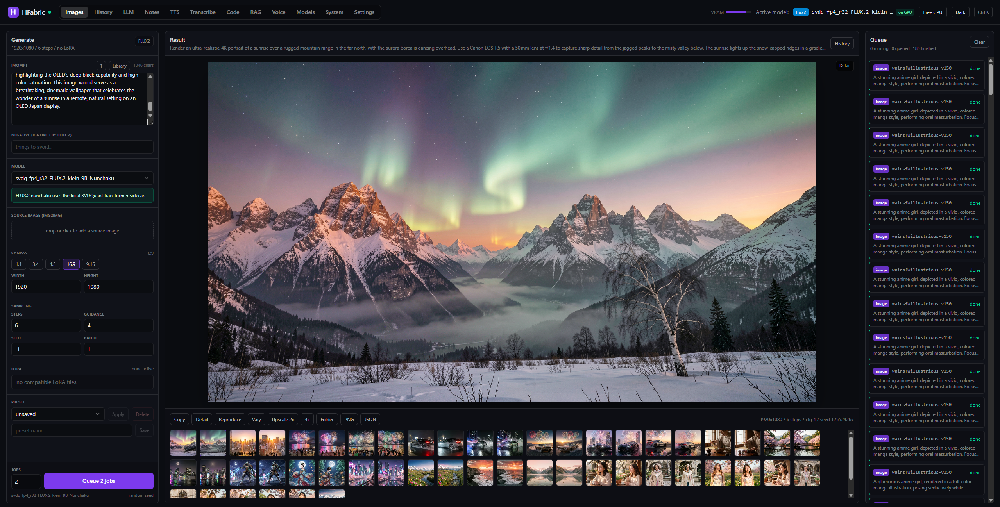
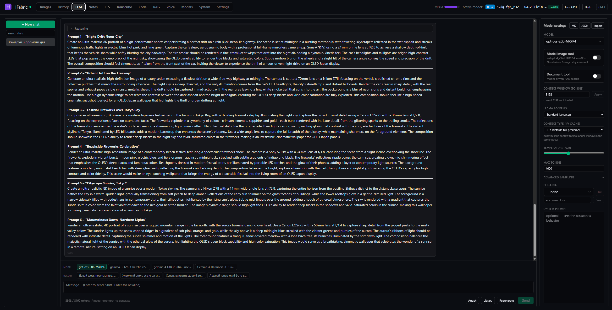
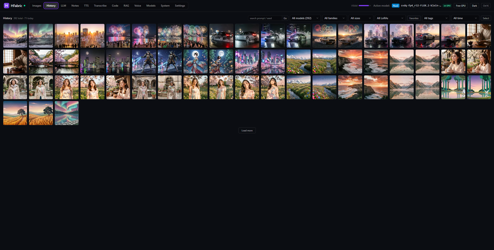
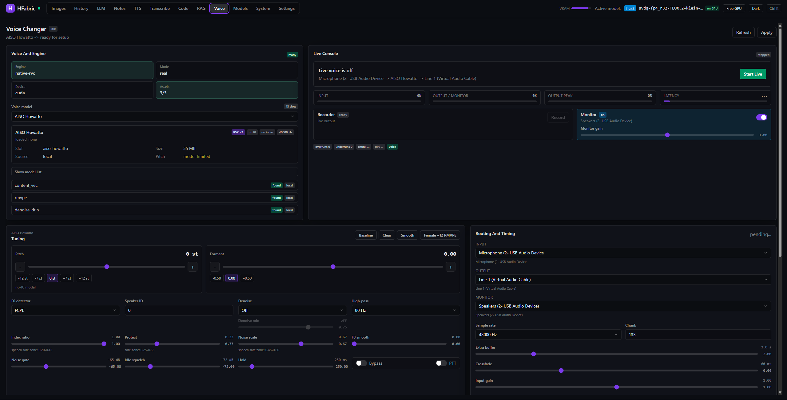

# HFabric

A **local, private AI workspace** for chat LLMs, image generation/editing, video
generation, RAG, speech tools, and a native voice changer on one consumer GPU. Its
core is a **VRAM arbiter**: at most one heavy model is resident at a time, so chat,
image, and video jobs swap cleanly instead of fighting over memory. Everything runs
on your machine; nothing is sent to a cloud service.

**Why try it:**

- **One 16 GB GPU, multiple heavy workflows:** LLM ↔ image ↔ video swaps are
  serialized by the arbiter and visible in the header VRAM meter.
- **Real creative surfaces:** chat-native `/image`, SDXL/FLUX/Qwen/Z-Image/Anima
  generation, Edit workspace, LTX/Wan video, RAG, TTS, transcription, and Voice.
- **Safe local defaults:** loopback bind, optional API token, RAM/VRAM guards before
  model loads, STUB mode for no-GPU testing, and a repeatable GPU smoke checklist.
- **Model management built in:** curated downloads, Hugging Face/CivitAI browsing,
  installed-model cleanup, and hardware-aware compatibility warnings.



<p align="center"><em>One 16 GB GPU, two heavy models (chat + diffusion), no OOM — the VRAM arbiter swaps them for you, and the header shows what's resident and the live VRAM.</em></p>

<table>
  <tr>
    <td width="33%"></td>
    <td width="33%"></td>
    <td width="33%"></td>
  </tr>
  <tr>
    <td align="center"><sub>Chat LLM — streaming, attachments, <code>/image</code></sub></td>
    <td align="center"><sub>History — filter, favorite, reproduce, export</sub></td>
    <td align="center"><sub>Voice — native real-time RVC changer</sub></td>
  </tr>
</table>

> **Project status: public beta (v0.3.0, B+).** `v0.1.0`, `v0.2.0`, and `v0.3.0`
> are tagged and released. The app is solid for the author's own daily use and now
> open to other testers, but it has **not** had wide hardware coverage yet.
>
> - **What works:** the full local pipeline — chat LLM, image/edit generation, video
>   generation, the VRAM arbiter, and the workspaces — is real-GPU validated on
>   **NVIDIA / Windows**.
> - **What's rough:** AMD ROCm and Apple Silicon are **experimental** (unvalidated on
>   real hardware); first-run validation is much better, but some hardware-specific
>   model and audio paths still need more tester coverage.
> - **Privacy:** everything runs on your machine; nothing is sent to a cloud service.
>
> Before reporting, skim [KNOWN_ISSUES.md](KNOWN_ISSUES.md) and the
> [Platform support](#platform-support) matrix; the
> [current audit](docs/audit-2026-06-30.md) is the most candid status
> snapshot. Found a security issue? See [SECURITY.md](SECURITY.md) — please report it
> privately.

## Table of contents

- [What you can run](#what-you-can-run)
- [Platform support](#platform-support)
- [Requirements](#requirements)
- [Quick start (no GPU)](#quick-start-no-gpu)
- [Full install (GPU)](#full-install-gpu)
- [Getting models](#getting-models)
- [Running the app](#running-the-app)
- [Updating](#updating)
- [Architecture](#architecture)
- [Configuration](#configuration)
- [Troubleshooting](#troubleshooting)
- [Documentation](#documentation)
- [License and models](#license-and-models)

## What you can run

The full pipeline (model discovery → queue → arbiter swap → live progress over
WebSocket → gallery with reproducible metadata) is validated on the GPU today:

- **Image:** SDXL, FLUX, FLUX.2 [klein], Anima, Qwen-Image, and Z-Image generation;
  a dedicated **Edit** workspace adds img2img, inpaint, outpaint, full-size mask
  painting, A/B comparison, ControlNet, and instruction-edit model support.
- **Video:** LTX-Video text-to-video and image-to-video plus Wan 2.2 text-to-video,
  served as seekable MP4 with poster/animated thumbnail history. On the reference
  16 GB GPU, 480p / 49-frame LTX T2V+I2V and Wan T2V are validated.
- **Chat LLM:** any GGUF model via `llama-server`, with streaming, personas,
  sampling control, stop/regenerate/edit, attachments, native multimodal
  `mmproj` vision, and a `/image` bridge.
- **Workspaces:** Edit, RAG, TTS, Transcribe, Notes, Code, and a native RVC Voice
  changer — all model-gated and CPU-first by default.
- **Models:** a unified manager for curated downloads, Hugging Face/CivitAI search,
  installed-model inventory, disk checks, and compatibility warnings.

The same pipeline also runs **without** torch or llama.cpp in **STUB mode**
(`HFAB_STUB_MODE=true`), which returns mock results. STUB mode is how the UI is
developed and how CI tests the whole queue→swap→gallery flow without a GPU.

## Platform support

The launcher probes your hardware and picks an install profile automatically. Be
aware of what's actually been validated:

| Platform | Profile | Status |
|----------|---------|--------|
| **NVIDIA CUDA (Windows)** | `nvidia-cuda` | ✅ **Validated** end-to-end on RTX 5070 Ti 16 GB (Blackwell), 32 GB RAM, Windows 11. The reference path. |
| NVIDIA CUDA (other tiers) | `nvidia-cuda` | ⚠️ Capability-aware (8 GB = SDXL/small-LLM safe mode, 12 GB +quantized LLMs, 16 GB+ richer set). Fast paths auto-disable below the required compute capability. Not yet validated on non-Blackwell silicon. |
| **AMD ROCm (Linux)** | `amd-rocm-linux` | 🧪 **Experimental** — implemented and unit-tested, but never run on real ROCm hardware. SDXL-only until validated. CUDA-only features (Nunchaku, etc.) auto-disable. Testers welcome. |
| **Apple Silicon (MPS)** | `apple-mps` | 🧪 **Experimental** — implemented and unit-tested, never run on a real Mac. SDXL + llama.cpp Metal, fp4 families hidden. Testers welcome. |
| Unsupported / no GPU | `cpu-safe` / STUB | ✅ Always works. CPU-safe falls back gracefully; STUB needs no ML stack at all. |

If you're on ROCm or Apple Silicon and willing to help validate, the
[GPU smoke checklist](docs/gpu-smoke.md) has the steps and a log to fill in.

## Requirements

| | |
|---|---|
| **GPU** | NVIDIA CUDA with 8+ GB VRAM recommended (16+ GB for the full image/video set). AMD ROCm (Linux) and Apple MPS supported conservatively. No supported GPU → CPU-safe/STUB. |
| **RAM** | 32 GB recommended (≈16 GB for models + 16 GB for OS/processes). |
| **OS** | Windows 11 (validated CUDA path), Linux (ROCm), macOS Apple Silicon (MPS). |
| **Disk** | 40+ GB for the starter set; 150 GB for the larger FLUX/SDXL/LLM workspace. |
| **Python** | Windows setup downloads and uses portable Python 3.12.10 from `.tools/` via NuGet. Linux/macOS: Python 3.12+ on PATH. |
| **Node.js** | Windows setup downloads and uses local Node.js/npm from `.tools/`. Linux/macOS: Node.js 18+ on PATH. |
| **Git** | optional, used by `huggingface-cli` for model downloads |

A recent GPU driver is needed for acceleration (`nvidia-smi` should report your
GPU on NVIDIA). Without one, setup still works in CPU-safe/STUB mode.

## Quick start (no GPU)

The fastest way to see the app: STUB mode runs the entire pipeline with mock
results and no ML libraries (~1–2 min first run).

```bat
:: Windows
run.bat stub
```

```bash
# Linux/macOS
./run.sh stub
```

```powershell
# PowerShell
powershell -NoProfile -ExecutionPolicy Bypass -File .\scripts\run.ps1 -Stub
```

On Windows this also bootstraps local Python/Node under `.tools/` when needed.
Then it creates the Python venv + npm deps on first run, starts the backend
(`:8260`) and the Vite dev server (`:5173`), and opens
<http://localhost:5173>. **Ctrl+C** stops both. Try the chat/image forms — you'll
see mock responses. This is the right mode for UI work and for confirming the
foundation before adding a GPU.

## Full install (GPU)

**REAL mode** loads actual LLMs and diffusion models onto your accelerator. Use
the setup script for your platform — it probes hardware and picks the recommended
profile (`nvidia-cuda`, `amd-rocm-linux`, `apple-mps`, or `cpu-safe`):

```bat
:: Windows
setup.bat          :: auto setup
setup.bat all      :: auto setup + download a profile-aware starter model set
```

```bash
# Linux/macOS
./setup.sh         # auto setup
./setup.sh all     # auto setup + starter models
```

```powershell
# PowerShell, if you prefer not to use setup.bat
powershell -NoProfile -ExecutionPolicy Bypass -File .\setup.ps1
powershell -NoProfile -ExecutionPolicy Bypass -File .\setup.ps1 -DownloadAll
```

The setup script: checks Python/Node (and on Windows downloads local managed
runtimes into `.tools/` when needed), probes hardware and selects a profile,
creates the venv, installs the profile's PyTorch wheels + Python deps, installs
npm packages, installs the managed `llama.cpp` build for your accelerator,
fetches the required shared voice-changer assets, installs Nunchaku only when you
pass `-Nunchaku`/`all`, and (with `all`) downloads the starter models plus
optional voice denoise assets. When finished, run the app with
`run.bat` / `./run.sh`.

<details>
<summary><b>Manual GPU install (advanced)</b></summary>

Start from the same resolver the installer uses, then install the emitted
packages:

```powershell
python scripts/hardware_probe.py --pretty     # machine report
python scripts/install_profiles.py --pretty    # chosen profile + packages
```

The current profiles map to:

```powershell
# NVIDIA CUDA
pip install torch==2.11.0 torchvision==0.26.0 torchaudio==2.11.0 --index-url https://download.pytorch.org/whl/cu128
pip install -r backend/requirements-gpu.txt

# Linux AMD ROCm
pip install torch==2.11.0 torchvision==0.26.0 torchaudio==2.11.0 --index-url https://download.pytorch.org/whl/rocm7.2
pip install -r backend/requirements-rocm.txt

# Apple Silicon MPS (standard PyPI wheels, no --index-url)
pip install torch==2.11.0 torchvision==0.26.0 torchaudio==2.11.0
pip install -r backend/requirements-mps.txt
```

Verify with `python scripts/install_smoke.py`. For faster FLUX on CUDA, install
the Nunchaku wheel **only** when `/api/capabilities` lists `nunchaku_cuda` in
`optional_features`:

```bash
pip install https://github.com/nunchaku-ai/nunchaku/releases/download/v1.3.0dev20260213/nunchaku-1.3.0.dev20260213+cu12.8torch2.11-cp312-cp312-win_amd64.whl
```

</details>

## Getting models

Models are **not** included in this repo and are not covered by its license — they
are user-supplied with their own provider terms (see
[MODEL_NOTICE.md](MODEL_NOTICE.md)). They live under `models/` and are read in
place; nothing is copied into the venv.

**Easiest:** once the app is running, open the **Models** tab. It lists curated
starter models that fit your hardware (Recommended preselected) with each model's
size, license, and target folder; lets you **browse any HuggingFace repo** and pick
specific files or the whole repo (or paste a direct URL); guards against filling the
disk; and downloads with a progress bar — no terminal needed. The same tab shows
everything installed (grouped by type, with sizes) and lets you **delete** models to
reclaim disk.

Advanced entries include large full-repo image models (FLUX.2 [klein],
Z-Image-Turbo, Qwen-Image-2512). They are not preselected because they are big
and may have provider-specific terms; expand **Advanced** in the Models tab when
you want them.

From the command line, the equivalent is the hardware-aware starter downloader
(also run by `setup … all`):

```bash
python scripts/fetch_models.py --dry-run                 # show the plan for this machine
python scripts/fetch_models.py --profile apple-mps --dry-run   # plan for another profile
python scripts/fetch_models.py                            # download
```

It fetches a safe SDXL Lightning starter + GGUFs for chat/RAG/TTS/chat-native
vision on CUDA, ROCm, and MPS, plus the Nunchaku FLUX fp4 checkpoint on CUDA
when supported.
CPU-safe/STUB downloads nothing.

For the full curated list, folder layout, and per-family notes (FLUX.2 klein,
Anima, Qwen-Image, Z-Image, voice/DTLN assets), see **[models/README.md](models/README.md)**.

## Running the app

```bat
run.bat            :: auto-select REAL/STUB from the hardware profile
run.bat stub       :: STUB mode: full pipeline, no GPU/ML stack
run.bat --prod     :: production: one FastAPI port serves the built frontend
run.bat --no-open  :: start without opening the browser
```

```bash
./run.sh           # same options on Linux/macOS
```

```powershell
powershell -NoProfile -ExecutionPolicy Bypass -File .\scripts\run.ps1 [-Stub] [-Prod] [-NoOpen]
```

On first run it bootstraps local Windows runtimes if needed, creates/repairs the
venv + npm deps, frees any stale ports left by an earlier run, installs any
missing profile packages, then runs the backend
(`:8260`) and the Vite dev server (`:5173`) together in one window and opens
<http://localhost:5173>. Ctrl+C stops both.

`--prod` builds the frontend and serves it from FastAPI on a single port (no Node
at runtime) — simpler for daily use and a smaller surface to secure.

After submitting a generation job, watch your GPU monitor (`nvidia-smi -l 1`,
`rocm-smi`, or Activity Monitor) fill and empty as the arbiter loads and frees the
model. The backend console (and `data/logs/hfabric.log`) shows timing, memory
snapshots, and load/unload events.

## Updating

Use the updater instead of hand-running git and package managers. On Windows it
uses the same local `.tools/` Python/Node bootstrap as setup/run:

```bat
update.bat          :: git pull + refresh dependencies
update.bat all      :: also refresh starter models + voice assets
update.bat --prod   :: also rebuild frontend/dist
```

```bash
./update.sh         # same options on Linux/macOS
```

```powershell
powershell -NoProfile -ExecutionPolicy Bypass -File .\update.ps1 [-DownloadAll] [-Prod]
```

If you have local source edits, the updater asks git to use `--autostash` so the
pull does not overwrite them silently. It does not delete `models/` or `data/`.

## Architecture

```
                       ┌───────────────── FastAPI (app.main) ─────────────────┐
  React + Tailwind ──► │  REST /api/*          WebSocket /ws (event stream)    │
  (Vite, :5173)        │     │                        ▲                        │
                       │     ▼                        │ events                 │
                       │  Queue (SQLite) ─► Worker ─► EventBus                  │
                       │                      │                                │
                       │                      ▼  phase-batching                │
                       │                 GpuArbiter  ── at most ONE resident   │
                       │                   /     \                             │
                       │     DiffusersImageBackend   LlamaCppBackend           │
                       │     (FLUX / SDXL / …)       (llama-server subprocess) │
                       └───────────────────────────────────────────────────────┘
```

Key backend modules:

- `app/core/arbiter.py` — the VRAM arbiter (load/unload, one resident max, RAM
  budget guard before every load).
- `app/core/scheduler.py` — single GPU worker + phase-batching select.
- `app/core/events.py` — in-process pub/sub, streamed over `/ws`.
- `app/backends/` — `registry` (scan model files), `image_diffusers`,
  `llm_llamacpp`.
- `app/services/capability_profile.py` — resolves what the detected hardware can
  safely run; gates models and features.
- `app/db/` — SQLAlchemy models; the queue is persisted (Alembic-migrated) and
  resumes on restart.

A full design walk-through is in the [developer guide](docs/developer.md).

## Configuration

Two surfaces, deliberately separated:

- **`.env`** — only system-startup posture (bind host/port, optional API token,
  frontend serving). Copy `.env.example` to `.env`.
- **Settings tab** — everything else (model paths, acceleration, memory policy,
  LLM runtime, speech/RAG/chat-native vision/voice), typed and saved to
  `data/settings-overrides.json`, applied live.

```env
HFAB_HOST=127.0.0.1
HFAB_PORT=8260
# HFAB_API_TOKEN=change-me     # required before binding to a LAN address
HFAB_SERVE_FRONTEND=false
```

**Security model in one line:** HFabric is a local single-user app bound to
`127.0.0.1` by default; exposing it on a LAN (`HFAB_HOST=0.0.0.0`) requires
`HFAB_API_TOKEN`, and desktop-reaching actions stay loopback-only regardless.

The full env/Settings/knob reference (acceleration, llama.cpp, LoRA, keep-warm,
speech/RAG/chat-native vision/voice, capability autotune) is in
**[docs/configuration.md](docs/configuration.md)**.

## Troubleshooting

| Symptom | Fix |
|---------|-----|
| **`WinError 10013: socket forbidden`** | A previous run still holds port 8260/5173. Re-run `run.bat` (it auto-kills stale processes), or `netstat -ano \| findstr :8260` then `taskkill /PID <pid> /F`. |
| **`ModuleNotFoundError: torch`** | Re-run `run.bat` / `./run.sh` or `update.bat`; launchers repair a missing REAL stack automatically. |
| **CUDA out of memory** | Lower **Settings → LLM runtime → GPU layers**, disable **torch.compile**, reduce resolution, try a smaller model, or check **Settings → Memory policy**. |
| **"No image models discovered"** | Models are missing or in the wrong folder. Confirm files under `models/image/`, `models/llm/`, etc., or run `python scripts/fetch_models.py`. |
| **Vite dev server won't start** | Port 5173 conflict (`run.bat` frees it automatically) or frontend dependencies are stale; re-run `run.bat` or `setup.bat`. |
| **Backend crashes after first request** | Re-run `update.bat` (or `setup.bat`) so the venv matches the current code; use `run.bat stub` to isolate UI/foundation issues. |

More detail and logs: the backend console and `data/logs/hfabric.log` are the
first places to look. Hardware/profile diagnostics:

```powershell
python scripts/hardware_probe.py --pretty
python scripts/install_profiles.py --pretty
```

## Documentation

| Doc | What's in it |
|-----|--------------|
| [docs/configuration.md](docs/configuration.md) | All env vars + Settings knobs + security model |
| [docs/developer.md](docs/developer.md) | Layout, testing, migrations, backup/restore, contributing |
| [docs/gpu-smoke.md](docs/gpu-smoke.md) | Real-GPU validation checklist + the validation log |
| [models/README.md](models/README.md) | Model folder layout + curated download list |
| [docs/voice-routing.md](docs/voice-routing.md) | Routing the voice changer into Discord/OBS/etc. |
| [docs/audit-2026-06-30.md](docs/audit-2026-06-30.md) | Current code-quality and stability audit (weaknesses + plan) |
| [CONTRIBUTING.md](CONTRIBUTING.md) | How to report a bug + open a PR |
| [KNOWN_ISSUES.md](KNOWN_ISSUES.md) | Beta limitations, by-design behavior, rough edges |
| [SECURITY.md](SECURITY.md) | Security model + how to report a vulnerability privately |
| [CHANGELOG.md](CHANGELOG.md) | What changed between versions |
| [ROADMAP.md](ROADMAP.md) | Forward plan + active backlog |
| [docs/history.md](docs/history.md) | The shipped-phases record (M0–P24) |

## License and models

HFabric application code is free and open-source software under the
[MIT License](LICENSE).

AI model weights, LoRA adapters, GGUF files, checkpoints, tokenizers, datasets,
and voices are **not included** in this repository and are **not** licensed by the
HFabric MIT License. They are user-supplied runtime inputs with their own provider
licenses and terms. See [MODEL_NOTICE.md](MODEL_NOTICE.md) for the full notice.
